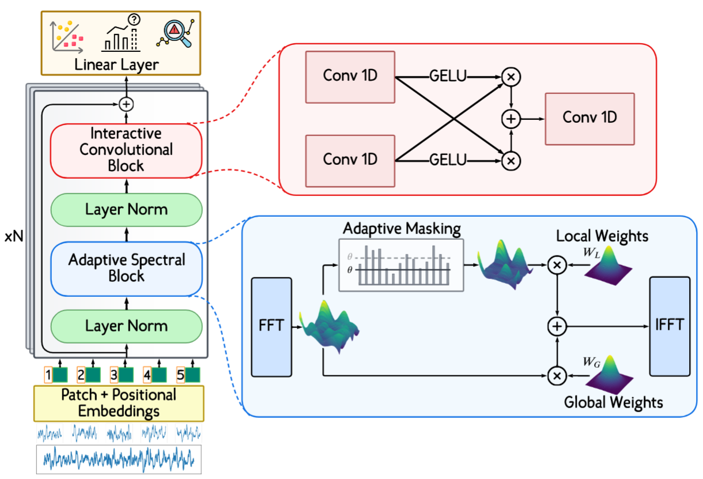

# SA-TSLANet: Spindle-Aware Time Series Lightweight Adaptive Network

[](https://opensource.org/licenses/MIT)
[](https://www.python.org/downloads/)
[](https://pytorch.org/)

## Overview

SA-TSLANet is a novel deep learning approach for chatter detection in milling operations. By integrating frequency domain knowledge with deep learning techniques, this model demonstrates significant improvements over traditional methods in both detection accuracy and early warning capabilities.

### Key Features

- 🎯 **99% accuracy** in chatter detection
- ⚡ **0.19s earlier detection** compared to FFT-based methods
- 🔧 **Robust generalization** with F1 score of 0.98 on limited training data
- 📊 **Physics-informed** spectral processing with spindle-aware components

## Architecture

SA-TSLANet extends the TSLANet architecture with:
- **Spindle-Aware Adaptive Spectral Block (SA-ASB)**: Separates spindle harmonics from chatter components
- **Interactive Convolution Block (ICB)**: Captures multi-scale temporal patterns
- **Multi-objective loss function**: Combines crest factor, spindle, and ratio losses



## Installation
```bash
# Clone the repository
git clone https://github.com/yourusername/SA-TSLANet.git
cd SA-TSLANet

# Create virtual environment
python -m venv venv
source venv/bin/activate  # On Windows: venv\Scripts\activate

# Install dependencies
pip install -r requirements.txt

# Install package in development mode
pip install -e .
